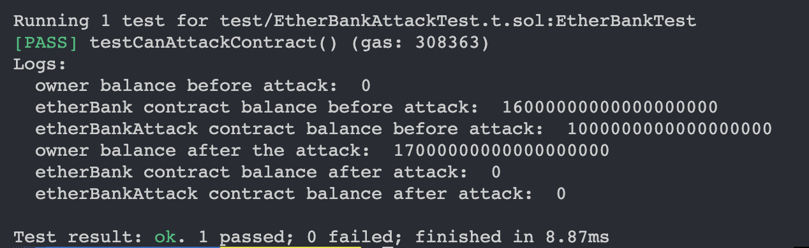

# About this Repository

This repository contains solution to a Solidity Re-entrancy attack challenge by [JohnnyTime](https://github.com/RealJohnnyTime/ReEntrancy-Attack/blob/main/contracts/EtherBank.sol).

## Contracts 
- EtherBank: A contract that has deposit and withdraw ETH functionalities and is vulnerable to the reentrancy attack.
- EtherBankAttack: An exploit contract to attack to withdraw an amount that is greater than the deposited amount and drainint the entire EtherBank contract balance. 

### Tests and Script
Both the Deploy script and tests are written in **foundry**. 
- Deploy script: `/script`
- Tests: `/test`

### Attack output
